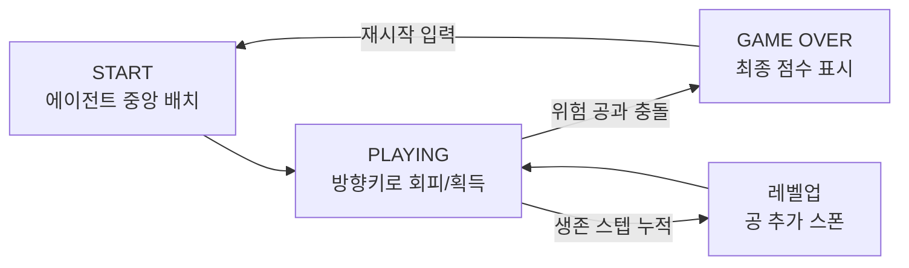
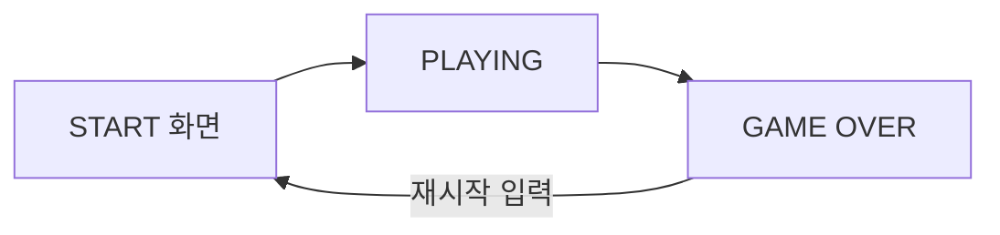

# 탄막 회피 시뮬레이션 게임 기획서

| 구분 | 내용 |
|------|------|
| 게임명 | 탄막 회피 시뮬레이션 게임 (가칭) |
| 장르 | 실시간 액션 회피 (Bullet-hell Dodge) |
| 플랫폼 | PC (Python + pygame 프로토타입) |
| 개발 단계 | Pre-production (기획 확정 → 프로토타입 착수 전) |
| 참고 자료 | [GitHub: Danmaku-RL](https://github.com/bokyung08/Danmaku-RL) · [레퍼런스 영상](https://vidkidz.tistory.com/13789) |
| 최종 목표 | 사람이 직접 플레이 가능한 결정적(deterministic) 시뮬레이터 → 강화학습(RL) 에이전트 학습 환경으로 확장 |

---

## 1. 게임 컨셉

**한 줄 정의:** 화면 좌측 상단에서 쏟아지는 공을 방향키로 피하며 최대한 오래 생존하고, 동시에 점수공을 먹어 점수를 올리는 미니멀 아케이드 게임.

**핵심 재미:**
- **회피의 손맛** — 벽에 튕기며 예측이 어려워지는 공들 사이에서 빈틈을 찾는 순간의 긴장감
- **리스크 vs 리워드** — 점수공을 먹으러 위험 지역에 들어갈지, 안전하게 생존만 할지의 선택
- **점진적 압박** — 시간이 지날수록(레벨업) 공이 누적되어 화면이 점점 빽빽해지는 난이도 곡선

**타겟:**
1. 플레이어블 데모 — 사람이 직접 방향키로 즐기는 캐주얼 아케이드
2. RL 벤치마크 환경 — 위 규칙을 그대로 감싸 강화학습 에이전트의 학습 환경으로 재사용 (본 기획서 범위 밖, 로드맵에서만 언급)

---

## 2. 핵심 루프 (Core Loop)

한 판은 "시작 → 회피하며 생존·점수공 획득 → 난이도 누적 → 피격 시 종료 → 재시작"의 짧은 루프를 반복한다. 목표는 "직전 판보다 오래/많이"라는 명확한 재도전 동기를 준다.

---

## 3. 오브젝트 명세

### 3.1 에이전트 (플레이어)

| 속성 | 값 | 비고 |
|------|----|------|
| 시작 위치 | 화면 정중앙 | 매 판 동일 (결정성 확보) |
| 반지름 | 10px | 충돌 판정 기준 |
| 이동 속도 | 5px/프레임 | 방향키 입력 시 즉시 반응 (가속 없음) |
| 이동 범위 | 화면 내부로 클리핑 | 화면 밖으로 나갈 수 없음 |
| 조작 | 방향키 4방향 + 정지 | 8방위 대각선 이동은 [§7 확장 계획] 참고 |

### 3.2 피해야 할 공 (위험 공)

- 화면 좌측 상단에서 스폰되어 우하향으로 이동, 벽에 부딪히면 해당 축 속도가 반전되며 튕긴다.
- 에이전트와 충돌 시 **즉시 게임 종료**(terminated).
- 개수·속도·크기는 레벨마다 미리 정의된 표를 사용한다(랜덤 스폰 없음 → 재현 가능한 난이도).

| 레벨 | 공 구성 (vx, vy, 반지름) | 비고 |
|------|--------------------------|------|
| 1 | 1개: (4, 3, 8) | 튜토리얼 성격 |
| 2 | 2개: (5,3,8) / (3,5,8) | |
| 3 | 3개: (5,4,10) / (4,5,10) / (6,2,10) | 반지름 확대 |
| 4 | 4개: (6,4,10) / (4,6,10) / (6,3,10) / (3,6,10) | |
| 5 | 5개: (7,5,12) / (5,7,12) / (7,4,12) / (4,7,12) / (6,6,12) | 최고 난이도 |

레벨업은 **교체가 아닌 누적** 방식이다. 레벨이 오르면 새 레벨의 공 세트가 기존 공 리스트에 더해져, 화면의 위협이 계속 쌓인다. 정의된 최고 레벨을 넘으면 더 이상 공이 추가되지 않고 유지된다.

### 3.3 점수공 (신규 기획 요소)

원문 컨셉에서 제시된 "닿으면 점수가 오르는 공"을 구체화한 요소로, 아래 항목은 **아직 규칙이 확정되지 않은 신규 기획**이다.

| 항목 | 초안 제안 | 결정 필요 여부 |
|------|-----------|----------------|
| 스폰 위치/주기 | 위험 공과 마찬가지로 좌상단 스폰 또는 화면 내 랜덤 위치 | **미결정** — 회피 난이도와의 밸런스 검토 필요 |
| 충돌 시 동작 | 먹으면 즉시 소멸 후 일정 시간 뒤 재생성 | **미결정** |
| 점수량 | 1개당 고정 점수(예: +50) | **미결정** — 생존 스텝 점수와의 비율 조정 필요 |
| 최대 동시 개수 | 레벨당 1~2개로 제한 | **미결정** |
| 위험 공과의 상호작용 | 서로 통과(충돌 없음)로 시작, 추후 튕김 여부 검토 | **미결정** |

> 점수공은 "생존=점수"라는 단일 지표에 "적극적으로 위험을 감수하고 점수를 챙긴다"는 선택지를 더해, 이후 RL 보상 설계에서도 회피(생존 보상)와 획득(즉시 보상)이라는 두 축을 제공하기 위한 장치다.

---

## 4. 점수 / 승패 규칙

- **기본 점수**: 생존한 프레임 수(steps)
- **추가 점수(신규)**: 점수공 획득 시 보너스 가산 — 배점은 §3.3 밸런스 확정 후 결정
- **종료 조건**: 에이전트가 위험 공에 닿는 즉시 종료(GAME OVER), 최종 점수 화면 표시
- **승리 조건 없음**: 하이스코어 경신형 엔드리스 게임

---

## 5. 레벨 전환 기준

| 레벨 | 다음 레벨로 전환되는 생존 스텝 |
|------|-------------------------------|
| 1 → 2 | 500 |
| 2 → 3 | 800 |
| 3 → 4 | 1200 |
| 4 → 5 | 1600 |
| 5 | 최고 레벨 (더 이상 전환 없음) |

프레임 수 기반의 명확한 임계값을 사용해 밸런스 조정과 QA 재현이 쉽도록 한다.

---

## 6. UX / 화면 흐름

| 화면 | 구성 요소 | 결정 필요 항목 |
|------|-----------|----------------|
| START | 조작법 안내, 시작 입력 대기 | 별도 타이틀 화면 여부 |
| PLAYING | 에이전트, 위험 공, 점수공, HUD(레벨/생존 스텝/점수) | — |
| GAME OVER | 최종 점수, 재시작 안내 문구 | 재시작 방식: 키 입력 즉시 재시작 vs 버튼 클릭 |

**색상 구분(초안):** 에이전트/위험 공/점수공을 색상으로 명확히 구분해 순간 판단이 가능하도록 한다(예: 에이전트=중립색, 위험 공=경고색 계열, 점수공=보상색 계열). 최종 팔레트는 비주얼 컨셉 확정 시 별도 협의.

---

## 7. 확장 계획 (이번 기획서 범위 밖)

| 항목 | 내용 |
|------|------|
| 행동 공간 확장 | 현재 정지+4방향(5종) → 정지+8방위(9종, 대각선 이동 포함)로 확장 검토 |
| 공-공 충돌 | 위험 공끼리 충돌 시 튕겨나가는 물리 추가 여부 검토 |
| 최대 공 개수 상한 | 레벨 누적 방식의 특성상 장시간 플레이 시 공이 무한히 쌓이므로 상한선 또는 별도 처리 필요 |
| RL 환경화 | 본 시뮬레이터를 그대로 감싸 강화학습 에이전트가 학습할 수 있는 환경(Gym 스타일)으로 확장. 상태/보상/에피소드 종료 조건은 본 기획서의 규칙을 그대로 재사용 |

---

## 8. 오픈 이슈 (결정 필요 항목 요약)

1. 점수공 스폰 규칙(위치/주기/재생성) 및 배점 확정
2. 재시작 방식: 키 입력 즉시 vs 버튼 클릭
3. 위험 공-공 간 충돌 처리 여부
4. 레벨 누적에 따른 공 최대 개수 상한
5. 최종 비주얼(색상/스타일) 컨셉
